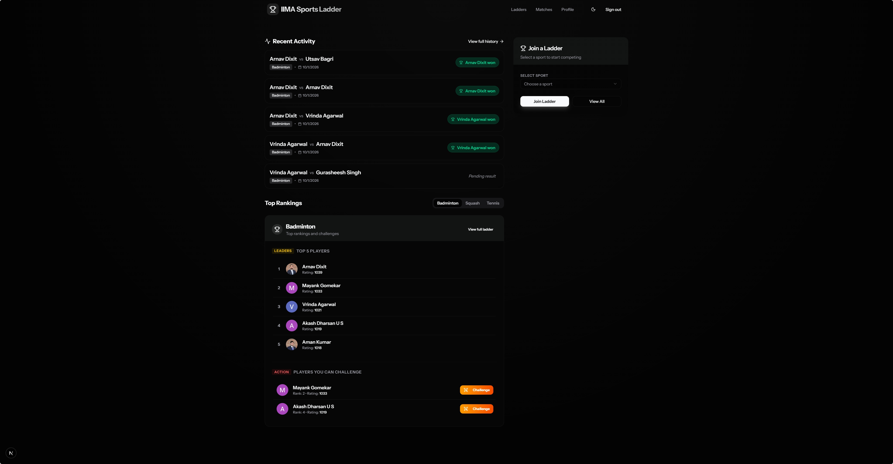
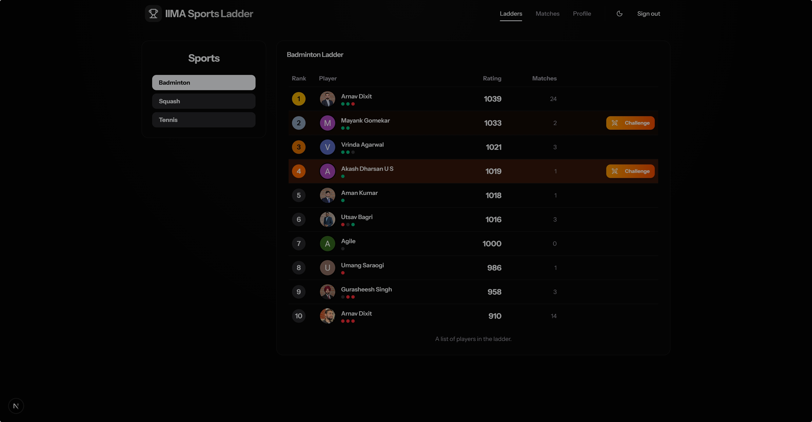
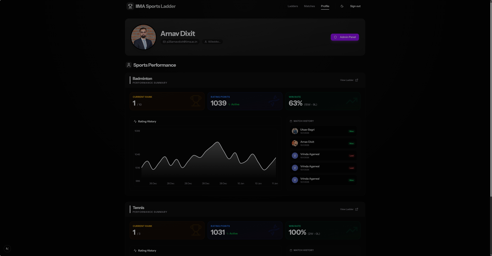
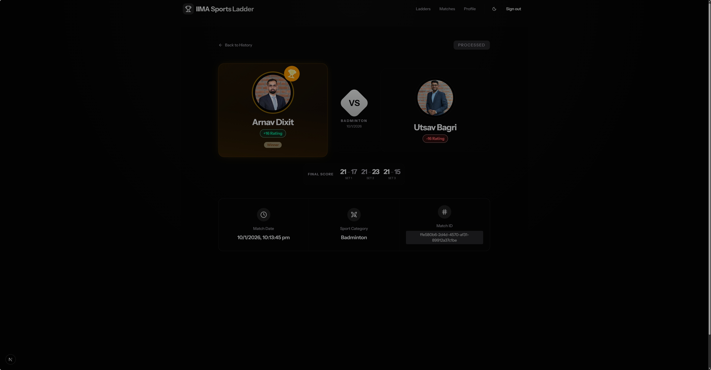
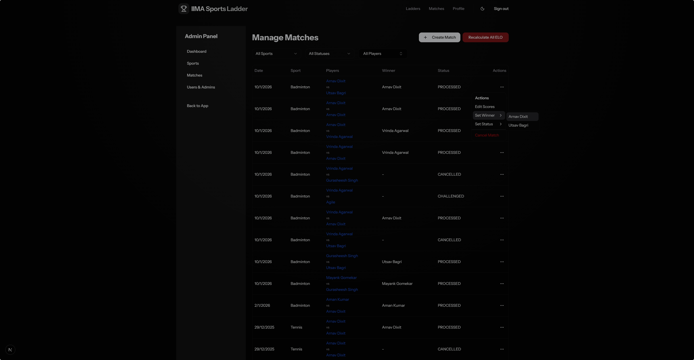

# Sports Ladder Application

A comprehensive full-stack application for managing competitive sports ladders, matches, and ELO ratings. Built with **Next.js**, **Supabase**, and **Inngest**.



## 📚 Documentation
- **[User Guide](docs/USER_GUIDE.md)**: How to challenge players, submit scores, and track progress.
- **[Admin Guide](docs/ADMIN_GUIDE.md)**: Managing sports, matches, and configurations.

## ✨ Features
- **Dynamic Ladders**: Automated ranking updates based on outcomes.
- **ELO Rating System**: Fair skill estimation adjusting after every confirmed match.
- **Challenge System**: Configurable rules for who can challenge whom (Range, Cooldowns).
- **Rich Match History**: Track wins, losses, and rating trends.
- **Email Notifications**: Powered by Inngest for transactional updates.
- **Admin Dashboard**: granular control over scoring rules and user management.

## 🛠️ Tech Stack
- **Frontend**: Next.js 14 (App Router), Tailwind CSS, Framer Motion.
- **Backend**: Supabase (PostgreSQL, Auth, Realtime).
- **Queues**: Inngest (Serverless queues for emails and background jobs).

## 🚀 Getting Started

### Prerequisites
- Node.js 18+
- Supabase Project
- Gmail Account (for SMTP) or other provider

### Installation

1. **Clone the repository**
   ```bash
   git clone <repo-url>
   cd sports-ladder
   ```

2. **Install dependencies**
   ```bash
   npm install
   ```

3. **Configure Environment**
   Create a `.env.local` file:
   ```bash
   NEXT_PUBLIC_SUPABASE_URL=your_supabase_url
   NEXT_PUBLIC_SUPABASE_ANON_KEY=your_anon_key
   SUPABASE_SERVICE_ROLE_KEY=your_service_role_key
   
   # Email
   GMAIL_USER=your_email@gmail.com
   GMAIL_APP_PASSWORD=your_app_password
   FROM_EMAIL=Sports Ladder <noreply@example.com>
   
   # Inngest
   INNGEST_EVENT_KEY=local
   INNGEST_SIGNING_KEY=local
   
   PUBLIC_SITE_URL=http://localhost:3000
   ```

4. **Run the Development Server**
   ```bash
   npm run dev
   ```

5. **Start Inngest (Background Jobs)**
   In a separate terminal:
   ```bash
   npx inngest-cli@latest dev
   ```
   Open `http://localhost:8288` to monitor events.

## 🔄 Match Lifecycle
1. **CHALLENGED**: Player A challenges Player B.
2. **PENDING**: Challenge accepted, waiting for match to be played.
3. **PROCESSING**: Result submitted by one player.
4. **CONFIRMED**: Result verified by the other player.
5. **PROCESSED**: ELO ratings updated.

## 📸 Screenshots
| | |
|:---:|:---:|
| **Ladder** | **Profile** |
|  |  |
| **Match Details** | **Admin Dashboard** |
|  |  |