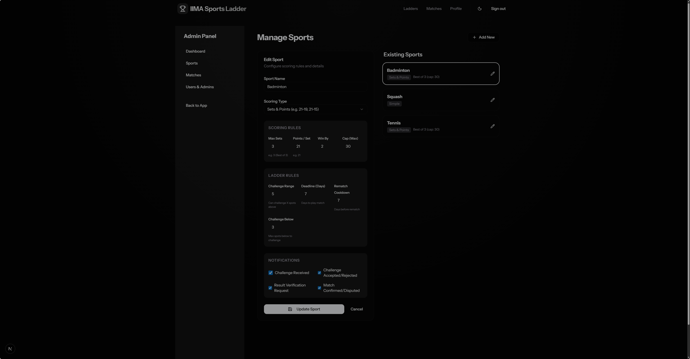

# Admin Guide

This guide details the administrative features for managing sports, matches, and users.

## Table of Contents
1. [Accessing Admin Tools](#accessing-admin-tools)
2. [Managing Sports](#managing-sports)
3. [Managing Matches](#managing-matches)
4. [User Management](#user-management)

---

## Accessing Admin Tools
If you have admin privileges, you will see an **Admin** link in the navigation bar. This opens the Admin Dashboard.

## Managing Sports
You can configure scoring rules and notification settings for each sport.

### Configuration Options
- **Scoring Type**: `Simple` (Win/Loss) or `Sets` (e.g., Best of 3).
- **Challenge Range**: How many ranks above oneself a player can challenge.
- **Challenge Below**: (Optional) Allow challenging lower-ranked players.
- **Cooldowns**: Days before a rematch is allowed.

### Notifications
Toggle email alerts for:
- New Challenges
- Match Actions (Accept/Reject)
- Result Submission
- Result Confirmation

## Managing Matches
The **Matches** tab allows you to oversee all games.

### Actions
Click the **Three Dots (...)** menu on any match to:
- **Set Winner**: Manually declare a winner.
- **Edit Scores**: Enter or correct match scores (e.g., 2-1).
- **Change Status**: Force status to Pending, Confirmed, etc.
- **Process ELO**: Manually trigger ELO recalculation if it failed or was skipped.
- **Cancel Match**: Void the match entirely.

## User Management
Manage player profiles, assign admin roles, or deactivate users.
- **Deactivate**: Hides a player from the ladder without deleting their history.
- **Make Admin**: Grants access to these tools.

## ELO System
The app uses a standard ELO rating system (K=32). ratings are updated automatically when a match is **Confirmed**.
- **Recalculate All**: If you change the starting rating or K-factor in the code, or if data is corrupted, you can re-run the entire history to correct ratings.
